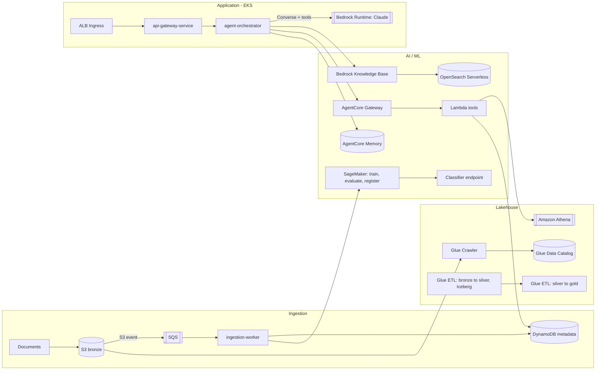

# Atlas — Data Lakehouse & Agentic AI Platform on AWS

Atlas is a document-intelligence platform for a company that
receives a steady stream of business documents — contracts, invoices,
support tickets, compliance reports — from every department. It ingests
them into a governed data lakehouse, classifies them automatically, and
gives employees a natural-language assistant that can answer questions
grounded in the company's own data, with citations, instead of guessing.

It's a project built to get real, depth with the stack
that actually runs cloud and AI infrastructure in production: **AWS,
Terraform, Docker, Kubernetes**, and the plumbing behind **LLM-powered and
agentic AI systems** (Bedrock, Bedrock AgentCore, SageMaker, Glue). Nothing
in here runs directly on a host — every process is a container, whether
that's a local Docker Compose stack or a Kubernetes Deployment on EKS.

## The scenario, concretely

> "What contracts are we on the hook for renewing next quarter, and which
> ones have auto-renewal clauses?"

An employee asks that in plain English. The agent decides it needs both a
structured answer (which contracts, which dates — a SQL query against
curated lakehouse tables) and unstructured context (what the auto-renewal
clause actually says — a semantic search over the source documents), runs
both, and answers with citations back to the source documents. That
decision-making and tool orchestration is the "agentic" part; everything
around it — the VPC, the cluster, the data lake, the model access, the
guardrails — is the "infrastructure" part. Both are the point of this repo.

## Architecture



Four layers, left to right in the diagram above, plus one cross-cutting
concern that touches all of them:

1. **Ingestion** — documents land in S3, an event fans out through SQS to a
   containerized worker that updates metadata and kicks off cataloguing.
2. **Lakehouse** — a medallion architecture (bronze/silver/gold) on S3,
   Iceberg tables in the Glue Data Catalog, queried through Athena.
3. **AI/ML** — a Bedrock Knowledge Base for retrieval-augmented search, a
   SageMaker pipeline for a classical ML classifier, and **Bedrock
   AgentCore** (Gateway + Memory) for productionizing the agent's tool use
   and session continuity.
4. **Application** — three containerized services on EKS: a public API
   gateway, an internal agent orchestrator, and the ingestion worker.

**Cross-cutting**: Terraform provisions all four layers; GitHub Actions
builds, tests, and deploys into them; IAM (with IRSA), KMS, and Cognito
secure every hop.

See **[ARCHITECTURE.md](ARCHITECTURE.md)** for the full design rationale,
including the decisions I'd make differently at real enterprise scale.

## Tech stack

| Category                   | Technology                                                                   |
| -------------------------- | ---------------------------------------------------------------------------- |
| Cloud provider             | AWS (VPC, EKS, S3, IAM/IRSA, KMS, Secrets Manager, Cognito, CloudWatch, ECR) |
| Infrastructure as code     | Terraform (8 modules, 2 environments)                                        |
| Containers & orchestration | Docker, Kubernetes (EKS), Helm                                               |
| Node compute               | Fargate (dev) / Karpenter-managed EC2 (prod)                                 |
| Data lakehouse             | S3, AWS Glue (Crawler + PySpark ETL), Iceberg table format, Athena           |
| Generative AI              | Amazon Bedrock (Claude via Converse API), Bedrock Guardrails                 |
| Agentic AI infrastructure  | Bedrock AgentCore (Gateway, Memory), Lambda-backed MCP tools                 |
| Classical ML / MLOps       | Amazon SageMaker (training, processing, Pipelines, Model Registry)           |
| CI/CD                      | GitHub Actions, OIDC-based AWS auth (no static keys)                         |
| Local development          | Docker Compose + LocalStack (no AWS account required)                        |

## Repository layout

```
infra/            Terraform: 8 modules + dev/prod environments
apps/              api-gateway-service, agent-orchestrator, ingestion-worker
lambda/            The two Lambda tools the AgentCore Gateway exposes
data-pipelines/    Glue ETL jobs (bronze -> silver -> gold)
ml/                SageMaker training, inference, and pipeline code
k8s/               Helm chart + Karpenter manifests
local-dev/         Docker Compose + LocalStack for zero-AWS-account demos
scripts/           bootstrap, deploy, sample data seeding
docs/              Cost notes and an operational runbook
.github/workflows/ CI, Terraform plan/apply, build & deploy
```

## Running it locally (no AWS account needed)

```bash
git clone https://github.com/gersimuca/atlas
cd atlas
make local-up      # builds and starts everything, LocalStack included
make seed-data     # uploads sample contracts/invoices/tickets
```

Then:

```bash
curl -X POST http://localhost:8000/chat -H 'Content-Type: application/json' \
     -d '{"session_id": "demo-1", "message": "What contracts do we have on file?"}'
```

Or just open `http://localhost:8000/docs` for the interactive Swagger UI.
The agent runs in **mock mode** by default (`USE_MOCK_LLM=true`) so this
works with zero AWS credentials — the full Bedrock Converse + tool-use code
path is real and exercised, it just returns a clearly-labeled mock answer
instead of calling the actual model. See `local-dev/.env.example` to point
it at real Bedrock instead.

## Deploying to AWS

```bash
cd infra/environments/dev
cat PREREQUISITES.md   # two manual one-time steps (state backend, IAM policy download)
terraform init && terraform plan && terraform apply

# then, from the repo root:
./scripts/deploy.sh dev
```

Expect the first apply to take 15–20 minutes (mostly the EKS control plane
and the OpenSearch Serverless collection). **Read
[docs/cost-estimate.md](docs/cost-estimate.md) before leaving this running**
— the vector store backing the Knowledge Base has a real idle-cost trap.

## Security highlights

- Every workload gets its **own IAM role via IRSA** — scoped to exactly
  what that service touches, nothing shared.
- **Two tool-execution modes**: direct AWS calls for local/small deployments,
  or routed through the **AgentCore Gateway** for centralized MCP tool
  governance and JWT-based auth in a real enterprise deployment.
- The `query_lakehouse` tool is **hardened against prompt-injected SQL** —
  regex-enforced `SELECT`-only, no statement chaining, forced row limits —
  both in the direct path and the Lambda behind the Gateway.
- **CI/CD uses OIDC**, not static AWS access keys, to assume a scoped IAM
  role — there is no long-lived AWS credential anywhere in this repo or in
  GitHub Secrets.
- Bedrock **Guardrails** (content filters, PII blocking, denied topics) are
  applied on every model call.
- Private subnets for all compute, VPC flow logs, KMS encryption on every
  data store, `NetworkPolicy` restricting which pods can talk to which.

## Q/A production system

- Multi-region DR and a real backup/restore drill, not just multi-AZ
- WAF in front of the ALB, and a private (non-public) EKS API endpoint
  behind a VPN/bastion
- Full Lake Formation column- and row-level governance, not just
  database-level grants
- Canary/blue-green deploys instead of a plain rolling update
- Distributed tracing (X-Ray or OpenTelemetry) across the two services and
  every AWS call they make
- KEDA for queue-depth-based autoscaling on the ingestion worker, instead
  of it running as a fixed replica count
- A migration from OpenSearch Serverless to Amazon S3 Vectors for the
  Knowledge Base once its Terraform schema is fully battle-tested

## License

MIT — see [LICENSE](LICENSE).
